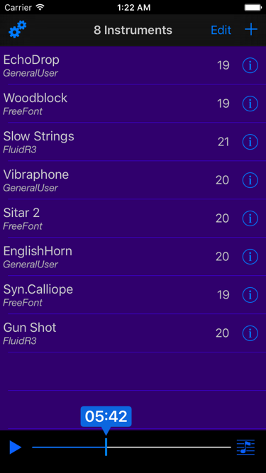
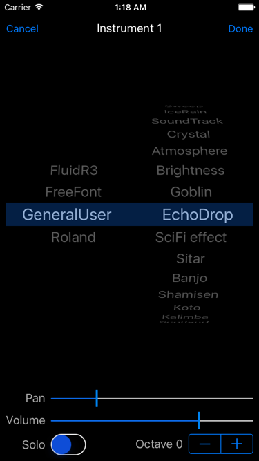

# Synth In C

 

This is a simple iOS application that plays Terry Riley's ["In C"](https://en.wikipedia.org/wiki/In_C) score
using one or more AudioUnit samplers. The score varies with each generation, but the algorithm that currently
does it is fairly simplistic. At times though, It does create some nice interplay among the voices.

The Swift code is fairly straightforward and it only uses stock iOS CoreAudio and AVFramework frameworks.

# Dependencies

* [InAppSettingsKit](https://github.com/futuretap/InAppSettingsKit) -- old but dependable framework for
showing and editing app settings in-app.
* [SwiftyUserDefaults](https://github.com/radex/SwiftyUserDefaults) -- nice Swift interface into NSUserDefaults.
* [ASValueTrackingSlider](https://github.com/alskipp/ASValueTrackingSlider) -- great bit of code for showing
UISlider values (see image above)

The first two have entries in the [Carthage](https://github.com/Carthage/Carthage) Cartfile. For the
ASValueTrackingSlider, I just copied the necessary files, unchanged.

# SoundFont Files

For some info on SoundFont files look [here](https://musescore.org/en/handbook/soundfont#list). To use the
`FluidR3\_GM` file, you will need to combine the FluidR3\_GM.sf2.1 and FluidR3\_GM.sf2.2 files into one. There
is a simple Bash script to this: `FluidR3\_GM.sh`. Just run like so:

```
% ./FluidR3_GM.sh
```

There is also a basic Python script called `catalog.py` which will generate a SoundFont catalog in Swift. There is
no integration with Xcode so you have to add the files yourself, but it may be handy nonetheless.
